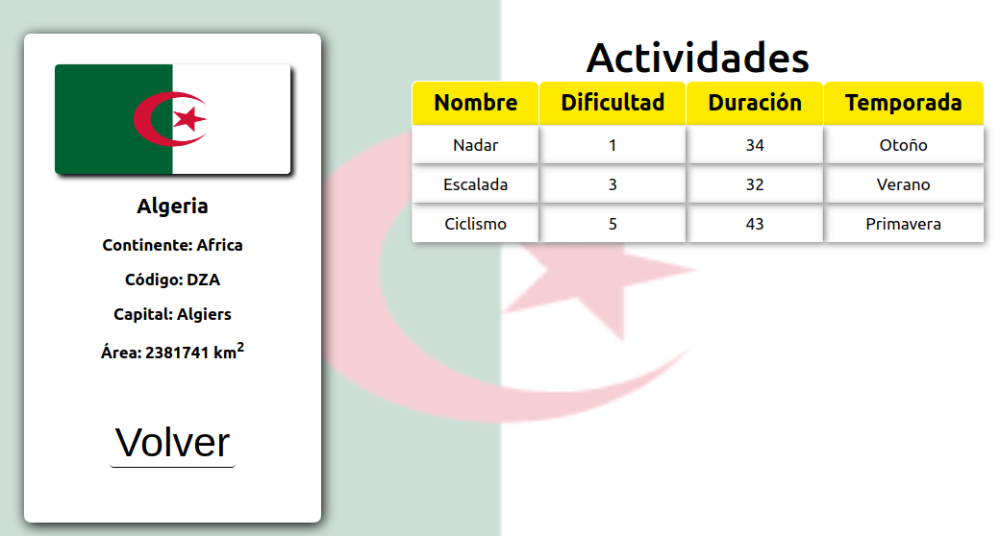

    

# IFull Stack - Countries APP

  

## Objetivos del Proyecto

- Construir una App utlizando React, Redux, Node y Sequelize.

## Descripción del proyecto

La aplicación presente esta pensada para la visualización de informacion asociada a todos los paises del mundo, en el mismo se muestra información como, nombre del pais, contienente, bandera, actividades turísticas entre otras.

__IMPORTANTE:__ 

La estructura base cuenta con dos carpetas: `api` y `client`. En estas carpetas estará el código del back-end y el front-end respectivamente.

Adicionalmente para este proyecto se utilizaraa una base de datos en postgreSQL la cual llevara por nombre `countries`

El contenido de `client` fue creado usando: Create React App.

## Visión general

La idea general es crear una aplicación en la cual se pueda ver información de  distintos paises utilizando la api externa [restcountries](https://restcountries.eu/) en su version 3 y a partir de ella poder, entre otras cosas:

  - Buscar paises
  - Filtrarlos / Ordenarlos
  - Crear actividades turísticas

### Únicos Endpoints/Flags utilizados

  - GET https://restcountries.eu/rest/v2/all
  - GET https://restcountries.eu/rest/v2/name/{name}
  - GET https://restcountries.eu/rest/v2/alpha/{code}

### Características específicas:

A continuación se detallan las características con las cuales ha sido dotada la presente aplicación. 

#### Tecnologías implementadas:
- [ ] React
- [ ] Redux
- [ ] Express
- [ ] Sequelize - Postgres

#### Frontend

Se debe desarrolló una aplicación de React/Redux que contenga las siguientes pantallas/rutas.

__Pagina inicial__:
contiene un landing page con
- [ ] Una imagen de fondo representativa al proyecto
- [ ] Un botón para ingresar al home (`Ruta principal`)

__Ruta principal__: Contiene
- [ ] Input de búsqueda para encontrar países por nombre
- [ ] Área donde se observa el listado de países. Al iniciar carga los primeros resultados obtenidos desde la ruta `GET /countries` y muestra:
  - Imagen de la bandera
  - Nombre
  - Continente
- [ ] Botones/Opciones para filtrar por continente y por tipo de actividad turística
- [ ] Botones/Opciones para ordenar tanto ascendentemente como descendentemente los países por orden alfabético y por cantidad de población
- [ ] Paginado para ir buscando y mostrando los siguientes paises, 10 paises por pagina, mostrando los primeros 9 en la primer pagina.

__Ruta de detalle de país__: contiene
- [ ] Los campos mostrados en la ruta principal para cada país (imagen de la bandera, nombre, código de país de 3 letras y continente)
- [ ] Código de país de 3 letras (id)
- [ ] Capital
- [ ] Subregión
- [ ] Área (Mostrarla en km2 o millones de km2)
- [ ] Actividades turísticas con toda su información asociada

__Ruta de creación de actividad turística__: contiene
- [ ] Un formulario __controlado__ con los siguientes campos
  - Nombre
  - Dificultad
  - Duración
  - Temporada
- [ ] Posibilidad de seleccionar/agregar varios países en simultaneo
- [ ] Botón/Opción para crear una nueva actividad turística

#### Base de datos

El modelo de la base de datos tiene las siguientes entidades (Aquellas propiedades marcadas con asterísco son obligatorias):

- [ ] País con las siguientes propiedades:
  - ID (Código de 3 letras) *
  - Nombre *
  - Imagen de la bandera *
  - Continente *
  - Capital *
  - Subregión
  - Área
  - Población
- [ ] Actividad Turística con las siguientes propiedades:
  - ID
  - Nombre
  - Dificultad (Entre 1 y 5)
  - Duración
  - Temporada (Verano, Otoño, Invierno o Primavera)

La relación entre ambas entidades es de muchos a muchos ya que un país puede contener varias actividades turísticas y, a su vez, una actividad turística puede darse en múltiples países.

#### Backend

Se desarrolló un servidor en Node/Express con las siguientes rutas:

- [ ] __GET /countries__:
  - En una primera instancia obtiene todos los países desde restcountries y los guarda en la base de datos  creada, luego toda la información es utilizada desde dicha base de datos (solo se almacenan los datos aca descritos).
  - Obtiene un listado de los paises.
- [ ] __GET /countries/{idPais}__:
  - Obtiene el detalle de un país en particular
  - Obtiene solo los datos pedidos en la ruta de detalle de país
  - Incluye los datos de las actividades turísticas correspondientes
- [ ] __GET /countries?name="..."__:
  - Obtiene los países que coincidan con el nombre pasado como query parameter (No necesariamente es por conicidencia exacta)
  - Si no existe ningún país muestra un mensaje adecuado
- [ ] __POST /activity__:
  - Recibe los datos recolectados desde el formulario controlado de la ruta de creación de actividad turística por body
  - Crea una actividad turística en la base de datos

  

  

  

  

